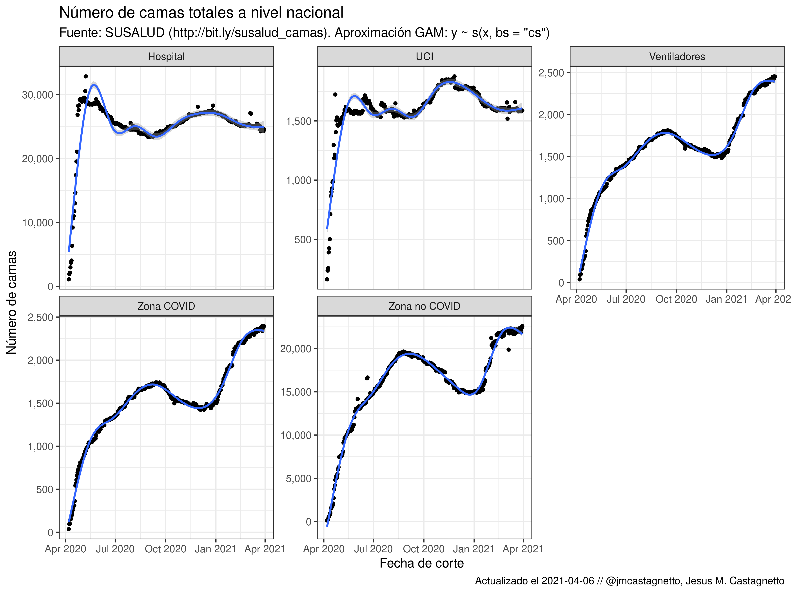
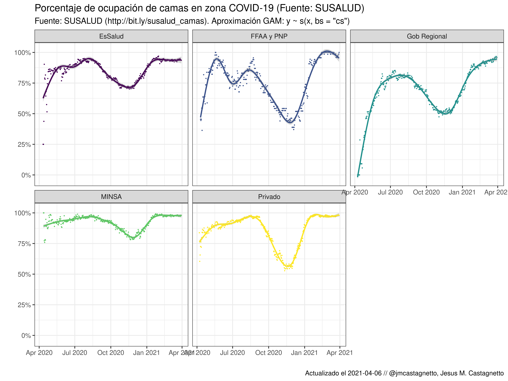
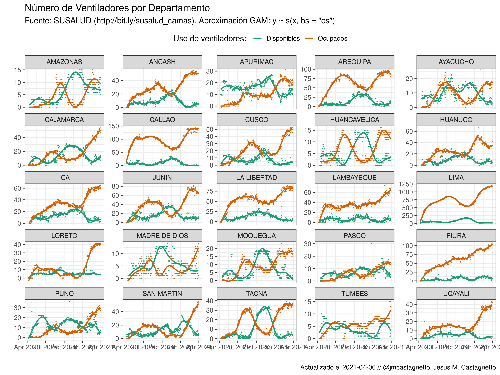

```{r setup, include=FALSE}
knitr::opts_chunk$set(
  echo = FALSE,
  message = FALSE,
  warning = FALSE
)
library(tidyverse)
library(skimr)
library(extrafont)
susalud_camas <- readRDS("datos/reporte_camas_aumentado.rds")
```

**Fuente**: "Data histórica del Registro de Camas diarias disponibles y ocupadas del formato F500.2" http://datos.susalud.gob.pe/dataset/data-hist%C3%B3rica-del-registro-de-camas-diarias-disponibles-y-ocupadas-del-formato-f5002


## Notas

- **2020-09-13**: Los datos ahora incluyen in campo extra `fecha_registro`
- **2020-09-21**: Algunos registros no tienen región/departamento asignados
- **2020-12-04**: Los datos de hoy tienen 121,600 registros, y los de hace un par de días atras (2020-12-02) eran 76,072. Un aumento de casi el 60% de registros comparando hoy con hace dos días. Parece que los datos posteriores al 2020-11-27 estaban incompletos, y recién se han actualizado en su totalidad.
- **2020-12-05**: Hoy se detectaron 220 registros con un incorrecto número de columnas, debido a que el nombre de un hospítal contiene una coma y no esta apropiadamente delimitado por comillas (HOSPITAL DE APOYO II - 2, SULLANA)

## Reporte rápido de datos

```{r echo=FALSE}
skim(susalud_camas, -correlativo)
```

## Evolución del número de camas disponibles

```{r}
df <- susalud_camas %>% 
  filter(region != "-") %>%
  group_by(fecha_corte) %>% 
  summarise(
    Zona_COVID = sum(camas_zc_total, na.rm = TRUE),
    Zona_no_COVID = sum(camas_znc_total, na.rm = TRUE),
    Hospital = sum(camas_hosp_total, na.rm = TRUE),
    uci_adultos = sum(uci_adultos_camas_total, na.rm = TRUE),
    uci_pediatria = sum(uci_pediatria_camas_total, na.rm = TRUE),
    uci_neonatal = sum(ucin_camas_total, na.rm = TRUE),
    UCI = sum(uci_adultos, uci_pediatria, uci_neonatal),
    Ventiladores_Ocupados = sum(ventiladores_uci_zc_ocupados, na.rm = TRUE),
    Ventiladores = sum(ventiladores_uci_zc_total, na.rm = TRUE),
  ) %>% 
  ungroup()

df_long <- df %>% 
  select(-uci_adultos, -uci_pediatria, -uci_neonatal) %>% 
  pivot_longer(
    cols = c(Zona_COVID, Zona_no_COVID, Hospital, UCI, Ventiladores),
    names_to = "seccion",
    values_to = "camas"
  ) %>% 
  mutate(
    seccion = str_replace_all(seccion, "_", " ") 
  )

p1 <- ggplot(df_long,
       aes(x = fecha_corte, y = camas, group = seccion)) +
  geom_point() +
  geom_smooth(method = "gam") +
  labs(
    y = "Número de camas",
    x = "Fecha de corte",
    title = "Número de camas totales a nivel nacional",
    subtitle = "Fuente: SUSALUD (http://bit.ly/susalud_camas). Aproximación GAM: y ~ s(x, bs = \"cs\")",
    caption = paste0("Actualizado el ", Sys.Date(), " // @jmcastagnetto, Jesus M. Castagnetto")
  ) +
  scale_y_continuous(labels = scales::comma) +
  theme_bw(14) +
  facet_wrap(~seccion, scales = "free_y")

ggsave(
  plot = p1,
  filename = "plots/camas-totales-nacional.png",
  width = 12,
  height = 9
)
```




## Cambio en el uso porcentual de camas en zona COVID-19 a nivel nacional

```{r}
df <- susalud_camas %>% 
  filter(region != "-") %>%
  group_by(fecha_corte, institucion) %>%
  summarise(
    pct_zn_ocu = sum(camas_zc_ocupados)/sum(camas_zc_total)
  ) %>%
  mutate_if(
    is.numeric,
    replace_na
  )

p2 <- ggplot(df %>% filter(institucion != "Otros"),
       aes(x = fecha_corte, y = pct_zn_ocu,
           group = institucion, color = institucion)) +
  geom_point(size = .3, show.legend = FALSE) +
  geom_smooth(method= "gam", show.legend = FALSE) +
  scale_color_viridis_d() +
  scale_y_continuous(labels = scales::percent) +
  labs(
    title = "Porcentaje de ocupación de camas en zona COVID-19 (Fuente: SUSALUD)",
    subtitle = "Fuente: SUSALUD (http://bit.ly/susalud_camas). Aproximación GAM: y ~ s(x, bs = \"cs\")",
    caption = paste0("Actualizado el ", Sys.Date(), " // @jmcastagnetto, Jesus M. Castagnetto"),
    x = "",
    y = ""
  ) +
  theme_bw(14) +
  facet_wrap(~institucion)

ggsave(
  plot = p2,
  filename = "plots/pct-ocupacion-zona-covid.png",
  width = 12,
  height = 9
)
```




## Cambios en la cantidad de ventiladores UCI en zona COVID-19


```{r}
df <- susalud_camas %>% 
  filter(region != "-") %>%
  group_by(fecha_corte, region) %>% 
  summarise(
    Disponibles = sum(ventiladores_uci_zc_disponible, na.rm = TRUE),
    Ocupados = sum(ventiladores_uci_zc_ocupados, na.rm = TRUE)#,
    #Ventiladores = sum(ventiladores_uci_zc_total, na.rm = TRUE),
  ) %>% 
  ungroup() %>% 
  pivot_longer(
    cols = c(Ocupados, Disponibles),
    names_to = "uso",
    values_to = "ventiladores"
  ) %>% 
  mutate(
    uso = str_replace(uso, "_", " ")
  )

p3 <- ggplot(df,
       aes(x = fecha_corte, y = ventiladores, 
           group = uso, color = uso)) +
  geom_point(size = .2) +
  geom_smooth(method = "gam", se = FALSE) +
  labs(
    title = "Número de Ventiladores por Departamento",
    subtitle = "Fuente: SUSALUD (http://bit.ly/susalud_camas). Aproximación GAM: y ~ s(x, bs = \"cs\")",
    caption = paste0("Actualizado el ", Sys.Date(), " // @jmcastagnetto, Jesus M. Castagnetto"),
    x = "",
    y = ""
  ) +
  scale_color_brewer(name = "Uso de ventiladores: ", palette = "Dark2") +
  theme_bw(14) +
  theme(
    legend.position = "top"
  ) +
  facet_wrap(~region, scales = "free_y")

ggsave(
  plot = p3,
  filename = "plots/uso-ventiladores-departamento.png",
  width = 12,
  height = 9
)
```


